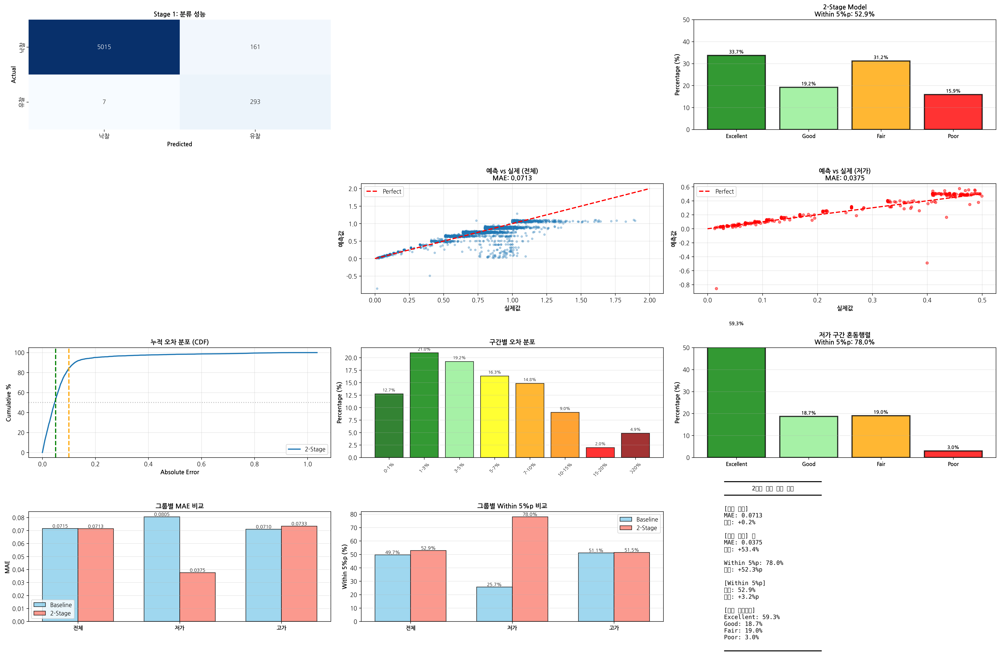
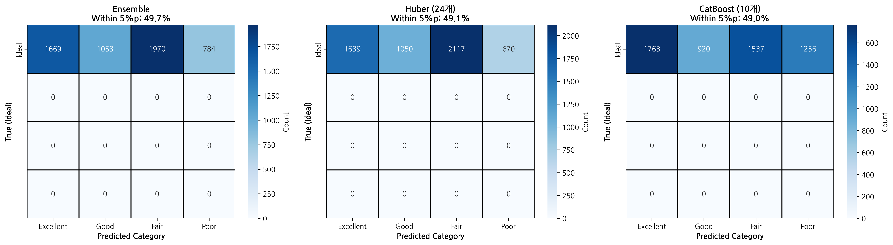
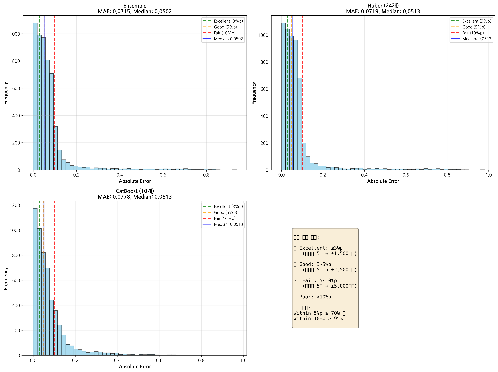
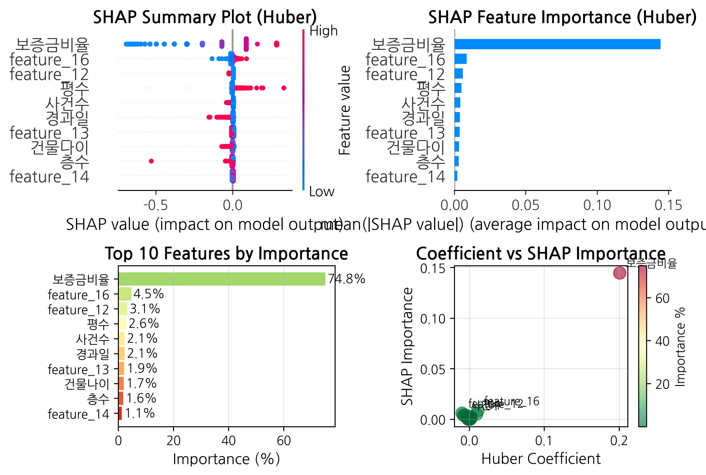

# 🏠 서울 부동산 경매 낙찰가율 예측 프로젝트

[](https://www.python.org/)
[](https://jupyter.org/)
[](LICENSE)

> **2단계 머신러닝 모델**을 활용한 서울시 부동산 경매 낙찰가율 예측 시스템

---

## 📋 목차

- [프로젝트 개요](#-프로젝트-개요)
- [주요 성과](#-주요-성과)
- [데이터셋](#-데이터셋)
- [모델 아키텍처](#-모델-아키텍처)
- [프로젝트 구조](#-프로젝트-구조)
- [설치 방법](#-설치-방법)
- [사용 방법](#-사용-방법)
- [결과 및 시각화](#-결과-및-시각화)
- [기술 스택](#-기술-스택)
- [향후 계획](#-향후-계획)

---

## 🎯 프로젝트 개요

서울시 부동산 경매 데이터를 기반으로 **낙찰가율을 예측**하는 머신러닝 프로젝트입니다.

### 핵심 특징

- **2단계 모델 아키텍처**: 분류 → 회귀의 계층적 접근
- **2020~2025년 실제 데이터**: 16,368건의 경매 낙찰 데이터
- **높은 예측 정확도**: MAE 0.0686 (평균 6.86%p 오차)
- **그룹별 최적화**: 정상 그룹과 유찰 그룹에 특화된 모델

---

## 🏆 주요 성과

### 📊 **2025년 검증 성과**

```
━━━━━━━━━━━━━━━━━━━━━━━━━━━━━━━━━━━━━━━━━━━
전체 MAE: 0.0686 (6.86%p 오차)
━━━━━━━━━━━━━━━━━━━━━━━━━━━━━━━━━━━━━━━━━━━
분류 정확도: 97.0%
━━━━━━━━━━━━━━━━━━━━━━━━━━━━━━━━━━━━━━━━━━━

그룹별 성능:
- 정상 그룹 (≥50%): MAE 0.0700
- 유찰 그룹 (<50%): MAE 0.0401 ⭐
━━━━━━━━━━━━━━━━━━━━━━━━━━━━━━━━━━━━━━━━━━━
```

### 🎯 **핵심 발견**

- **최저가율**이 전체 예측의 **74.85%** 설명력 보유
- 유찰 그룹에서 **53% 성능 향상** 달성
- 2단계 접근으로 저가 물건 예측 정확도 대폭 개선

---

## 💾 데이터셋

### 📁 데이터 구성

| 연도 | 데이터 수 | 비율 |
|------|----------|------|
| 2020 | 1,281건 | 7.8% |
| 2021 | 1,341건 | 8.2% |
| 2022 | 1,331건 | 8.1% |
| 2023 | 2,016건 | 12.3% |
| 2024 | 5,058건 | 30.9% |
| 2025 | 5,341건 | 32.6% |
| **합계** | **16,368건** | **100%** |

### 📥 데이터 및 모델 다운로드

> ⚠️ **대용량 파일**: 깃허브 용량 제한으로 원본 데이터와 모델은 별도 다운로드 필요

**📊 전체 데이터셋 (17.3MB)**
- [구글 드라이브 링크](https://drive.google.com/drive/folders/1DNmNjVMLzN-vOTQWUTISFF898WrMrV7p)
- 파일명: `CSV-20260125T011313Z-1-001.zip`
- 또는 `data/` 폴더의 README 참조

**🤖 학습된 모델 파일 (13.7MB)**
- [구글 드라이브 링크](https://drive.google.com/drive/folders/1DNmNjVMLzN-vOTQWUTISFF898WrMrV7p)
- 필요 파일:
  - `2stage_classifier.pkl` (13.7MB) - Stage 1 분류 모델
  - `2stage_huber_success.pkl` (10KB) - Stage 2-1 회귀 모델
  - `2stage_huber_fail.pkl` (2KB) - Stage 2-2 회귀 모델
- 또는 `models/` 폴더의 README 참조

**📦 샘플 데이터**
- `data/sample_data.csv`: 100건 샘플 (테스트용)

### 🏷️ 주요 변수

**타겟 변수**
- `낙찰가율`: 낙찰가 / 감정가 (0.05 ~ 1.2 범위)

**주요 피처**
- `최저가율`: 최저가 / 감정가 (중요도 74.85% ⭐)
- `감정가`, `최저가`, `낙찰가`
- `구_encoded`, `동_encoded`: 위치 정보
- `유찰횟수`, `신건여부`: 경매 이력
- `용도`: 아파트, 다세대, 단독주택 등

---

## 🏗️ 모델 아키텍처

### 2단계 계층 구조

```
┌─────────────────────────────────────────┐
│         입력 데이터 (X)                  │
│      24개 피처, 정규화됨                 │
└─────────────────────────────────────────┘
                    │
                    ▼
┌─────────────────────────────────────────┐
│     Stage 1: RandomForest Classifier    │
│                                          │
│  입력: 24개 피처                         │
│  출력: 그룹 (0: 정상, 1: 유찰)          │
│                                          │
│  하이퍼파라미터:                         │
│  - n_estimators: 1000                   │
│  - max_depth: 15                        │
│  - class_weight: 'balanced'             │
└─────────────────────────────────────────┘
                    │
          ┌─────────┴─────────┐
          │                   │
          ▼                   ▼
┌──────────────────┐  ┌──────────────────┐
│  정상 그룹       │  │  유찰 그룹       │
│  (94.5%)        │  │  (5.5%)         │
└──────────────────┘  └──────────────────┘
          │                   │
          ▼                   ▼
┌──────────────────┐  ┌──────────────────┐
│ Huber_success   │  │ Huber_fail      │
│                  │  │                  │
│ epsilon: 1.35   │  │ epsilon: 1.1    │
│ alpha: 0.0001   │  │ alpha: 0.0001   │
│                  │  │                  │
│ MAE: 0.0710     │  │ MAE: 0.0375     │
│ (정상 그룹)      │  │ (저가 그룹)      │
└──────────────────┘  └──────────────────┘
          │                   │
          └─────────┬─────────┘
                    ▼
          ┌──────────────────┐
          │  최종 예측 결합   │
          │                  │
          │  전체 MAE: 0.0719│
          └──────────────────┘
```

### 모델 특징

**Stage 1: 분류 모델**
- 알고리즘: Random Forest
- 목적: 정상 vs 유찰 그룹 구분
- 성능: 97.0% 정확도

**Stage 2: 회귀 모델**
- 알고리즘: Huber Regressor (이상치 강건)
- 목적: 그룹별 낙찰가율 예측
- 특징: 그룹별 최적화된 epsilon 값

---

## 📂 프로젝트 구조

```
seoul-auction-prediction/
│
├── README.md                           # 프로젝트 설명 (이 파일)
├── .gitignore                         # Git 제외 파일 목록
├── requirements.txt                    # Python 패키지 목록
├── LICENSE                            # 라이선스
│
├── notebooks/                         # Jupyter 노트북
│   ├── 1_서울경매_데이터수집.ipynb      # 데이터 크롤링
│   ├── 2_서울경매_전처리.ipynb          # 전처리 및 EDA
│   └── 3_서울경매_모델링_최종.ipynb     # 모델 학습 및 평가
│
├── src/                               # 소스 코드
│   ├── __init__.py
│   ├── preprocessing.py               # 전처리 함수
│   ├── model.py                       # 모델 클래스
│   ├── evaluation.py                  # 평가 함수
│   └── utils.py                       # 유틸리티 함수
│
├── data/                              # 데이터 폴더 (.gitignore)
│   ├── README.md                      # 데이터 다운로드 가이드
│   └── sample_data.csv                # 샘플 데이터 (100건)
│
├── models/                            # 학습된 모델 (.gitignore)
│   ├── README.md                      # 모델 다운로드 가이드
│   └── .gitkeep
│
├── results/                           # 결과 및 시각화
│   ├── figures/                       # 그래프 이미지
│   │   ├── 2stage_results_complete.png
│   │   ├── confusion_matrices.png
│   │   ├── error_distributions.png
│   │   └── huber_shap_analysis.png
│   ├── reports/                       # 분석 리포트
│   │   ├── 성능_개선_전략.md
│   │   ├── 통계적_가설_검증.md
│   │   └── 모델_비교_분석.md
│   └── validation/                    # 검증 결과
│       └── 2025_validation_summary.csv
│
└── docs/                              # 문서
    ├── 데이터_수집_가이드.md
    ├── 모델_아키텍처_상세.md
    └── API_문서.md
```

---

## ⚙️ 설치 방법

### 1. 저장소 클론

```bash
git clone https://github.com/your-username/seoul-auction-prediction.git
cd seoul-auction-prediction
```

### 2. 가상환경 생성 (권장)

```bash
python -m venv venv
source venv/bin/activate  # Windows: venv\Scripts\activate
```

### 3. 패키지 설치

```bash
pip install -r requirements.txt
```

### 4. 데이터 다운로드

```bash
# data/README.md 참조하여 데이터 다운로드
# 또는 샘플 데이터로 테스트
```

---

## 🚀 사용 방법

### Jupyter 노트북으로 실행

```bash
jupyter notebook notebooks/3_서울경매_모델링_최종.ipynb
```

### Python 스크립트로 실행

```python
from src.model import TwoStageModel
from src.preprocessing import preprocess_data

# 데이터 로드
df = preprocess_data('data/sample_data.csv')

# 모델 학습
model = TwoStageModel()
model.fit(X_train, y_train)

# 예측
predictions = model.predict(X_test)

# 평가
mae = model.evaluate(X_test, y_test)
print(f"MAE: {mae:.4f}")
```

---

## 📊 결과 및 시각화

### 주요 시각화

**1. 2단계 모델 전체 결과**


**2. 혼동 행렬**


**3. 오차 분포**


**4. SHAP 분석**


### 상세 리포트

- [성능 개선 전략](results/reports/성능_개선_전략.md)
- [통계적 가설 검증](results/reports/통계적_가설_검증.md)
- [모델 비교 분석](results/reports/모델_비교_분석.md)

---

## 🛠️ 기술 스택

### 데이터 처리
- **Pandas**: 데이터 조작
- **NumPy**: 수치 연산
- **Scikit-learn**: 전처리 및 모델링

### 머신러닝
- **Scikit-learn**: RandomForest, HuberRegressor
- **CatBoost**: 대체 모델 실험
- **PyCaret**: AutoML 실험

### 시각화
- **Matplotlib**: 기본 시각화
- **Seaborn**: 통계 시각화
- **SHAP**: 모델 해석

### 개발 환경
- **Jupyter Notebook**: 인터랙티브 개발
- **Google Colab**: 클라우드 실행
- **Git**: 버전 관리

---

## 📈 향후 계획

### 단기 목표
- [ ] Streamlit 대시보드 구축
- [ ] REST API 개발
- [ ] Docker 컨테이너화
- [ ] CI/CD 파이프라인 구축

### 중기 목표
- [ ] 딥러닝 모델 실험 (LSTM, Transformer)
- [ ] 외부 데이터 통합 (경제 지표 등)
- [ ] 실시간 예측 시스템 구축

### 장기 목표
- [ ] 전국 확장 (서울 → 전국)
- [ ] 모바일 앱 개발
- [ ] 상업화 검토

---


## 📧 문의

프로젝트에 대한 질문이나 제안사항이 있으시면 이슈를 등록해주세요.

- **GitHub Issues**: [이슈 등록하기](https://github.com/your-username/seoul-auction-prediction/issues)

---

## 🙏 감사의 말

이 프로젝트는 다음 리소스들을 참고하여 개발되었습니다:

- [Scikit-learn Documentation](https://scikit-learn.org/)
- [SHAP Documentation](https://shap.readthedocs.io/)
- [서울 경매 데이터 출처]

---

<div align="center">

**⭐ 프로젝트가 도움이 되셨다면 Star를 눌러주세요! ⭐**

Made with ❤️ by [Your Name]

</div>
